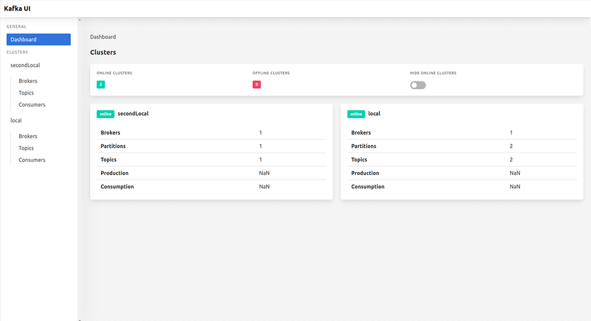

 Kafka UI – Free Web UI for Kafka &nbsp; 
------------------


<em>Kafka UI is a free open-source web UI for monitoring and management of Apache Kafka clusters. </em> 

Kafka UI is a simple tool that makes your data flows observable, helps find and troubleshoot issues faster and deliver optimal performance. Its lightweight dashboard makes it easy to track key metrics of your Kafka clusters - Brokers, Topics, Partitions, Production, and Consumption. 

Set up Kafka UI with just a couple of easy commands to visualize your Kafka data in a comprehensible way. You can run the tool locally or in the cloud. 




# Features
* **Multi-Cluster Management** — monitor and manage all your clusters in one place
* **Performance Monitoring with Metrics Dashboard** —  track key Kafka metrics with a lightweight dashboard
* **View Kafka brokers** — view topic and partition assignments, controller status
* **View Kafka topics** — view partition count, replication status, and custom configuration
* **View consumer groups** — view per-partition parked offsets, combined and per-partition lag
* **Browse messages** — browse messages with JSON, plain text and Avro encoding
* **Dynamic Topic Configuration** — create and configure new topics with dynamic configuration
* **Configurable authentification** — secure your installation with optional Github/Gitlub/Google OAuth 2.0
 


# Building

## Prerequisites

* Java 13 or newer

Optional:

* Docker 

## Installing Prerequisites on Mac
1. Install Homebrew Cask:
```sh
> brew update
> brew cask
``` 
2. Install JAVA 13 with Homebrew Cask:
```sh
> brew tap homebrew/cask-versions
> brew cask install java (or java13 if 13th version is not the latest one)
``` 
# Getting Started

You can build Kafka UI locally or run using Docker image. 

## Running Kafka UI From Docker Image
The official Docker image for Kafka UI is hosted here: [hub.docker.com/r/provectus/kafka-ui](https://hub.docker.com/r/provectus/kafka-ui).

Launch Docker container in the background:
```sh

docker run -d {}/kafka-ui-api:latest 
	-e KAFKA_CLUSTERS_0_NAME=local 
	-e KAFKA_CLUSTERS_0__BOOTSTRAPSERVERS=kafka0:29092

```
Then access the web UI at [http://localhost:9000](http://localhost:9000).
 

## Running Kafka UI Locally with Docker

Building Kafka UI locally with Docker is super easy and takes just a couple of commands to run the UI. The whole workflow step-by-step: 

1. Install Java, Docker and Docker Engine
2. Clone this repository and open a terminal in the directory of the project
3. Build a Docker container with Kafka UI
4. Start Kafka UI with your Kafka clusters
5. Navigate to Kafka UI 

To build a Docker container with Kafka UI (step 3): 
```sh
./mvnw clean install -Pprod
``` 
To start Kafka UI with your Kafka clusters (step 4): 
```sh
docker-compose -f ./docker/kafka-ui.yaml up
``` 
To see Kafka UI, navigate to http://localhost:8080 (step 5).

If you want to start only kafka-clusters: 
```sh
docker-compose -f ./docker/kafka-clusters-only.yaml up
``` 
Then start Kafka UI with a **local** profile. 

## Running Kafka UI Locally Without Docker

```sh
.cd kafka-ui-api
./mvnw spring-boot:run -Pprod
``` 


## Running in Kubernetes (using a Helm Chart)
To be done

# Guides

To be done

## Connecting to a Secure Broker

Kafka UI supports TLS (SSL) and SASL connections for [encryption and authentication](http://kafka.apache.org/090/documentation.html#security). This can be configured by providing a combination of the following files (placed into the Kafka root directory):

To be continued


### Using Docker

#### Environment Variables
##### Configuration
Example of how to configure clusters in the [application-local.yml](https://github.com/provectus/kafka-ui/blob/master/kafka-ui-api/src/main/resources/application-local.yml) configuration file:


```sh
kafka:
  clusters:
    -
      name: local
      bootstrapServers: localhost:29091
      zookeeper: localhost:2183
      schemaRegistry: http://localhost:8085
#     schemaNameTemplate: "%s-value"
      jmxPort: 9997
    -
```    


* `name`: cluster name
* `bootstrapServers`: where to connect
* `zookeeper`: zookeeper service address
* `schemaRegistrys`: schemaRegistrys address
* `schemaNameTemplate`: how keys are saved to schemaRegistry
* `jmxPort`: open jmxPosrts of a broker

Configure as many clusters as you need adding their configs below.

Alternatively, each variable of of the .yml file can be set with an environment variable. 
For example, if you want to use an environment variable to set the `name` parameter, you can write it like this: 

`KAFKA_CLUSTERS_2_NAME`

 

